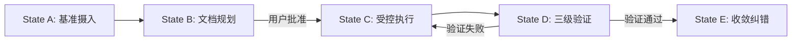

# 程序法索引 (Procedural Law Index)

**版本**: v1.8.1 (宪法升级版 - 从MY-DOGE-DEMO v6.8.1同步)
**状态**: 🟢 活跃
**说明**: MY-DOGE-MACRO程序法工作流索引，整合了所有开发、运维与危机处理流程。

---

## 第一章：核心工作流 (§200-§209)

| 条款 | 工作流名称 | 文件路径 (Pointer) | 核心用途 |
|------|------------|-------------------|----------|
| **§201** | **CDD流程** | `workflows/WF-201_宪法驱动开发工作流程实现.md` | **新功能开发/重构 (默认流程)** |
| **§202** | 灰度晋升 | `workflows/WF-202_灰度晋升协议工作流程实现.md` | 代码从 Staging 到 Prod 的晋升 |
| **§203** | 知识管理 | `workflows/WF-203_知识管理流程工作流程实现.md` | 知识库的增删改查 |
| **§204** | 危机处理 | `workflows/WF-204_危机处理流程工作流程实现.md` | 系统崩溃或数据损坏时的应急响应 |
| **§205** | 版本发布 | `workflows/WF-205_版本发布流程工作流程实现.md` | 发版与 Changelog 生成 |
| **§206** | 三位一体收敛 | `workflows/WF-206_三位一体收敛协议工作流程实现.md` | 解决架构、代码、文档不一致 |
| **§207** | 文件审查隔离 | `workflows/WF-207_文件审查与隔离协议工作流程实现.md` | 敏感文件或不受信代码处理 |
| **§209** | 房间绑定 | `workflows/WF-209_房间绑定信息读取流程工作流程实现.md` | 多房间环境配置 |

---

## 第二章：专项操作流程 (§210-§229)

| 条款 | 工作流名称 | 文件路径 (Pointer) | 核心用途 |
|------|------------|-------------------|----------|
| **§210** | 安全操作 | `workflows/WF-210_安全操作流程工作流程实现.md` | 涉及鉴权、加密的操作 |
| **§220** | MCP运维 | `workflows/WF-220_MCP运维流程工作流程实现.md` | MCP 服务器的部署与维护 |

---

## 第三章：孵化与回流流程 (§230-§239)

| 条款 | 工作流名称 | 文件路径 (Pointer) | 核心用途 |
|------|------------|-------------------|----------|
| **§230** | **项目孵化流程** | `storage/memory_bank/03_protocols/workflows/WF-230_项目孵化流程工作流程实现.md` | **从主项目创建专门化子项目进行实验性开发** |
| **§231** | 架构回流流程 | `storage/memory_bank/03_protocols/workflows/WF-231_架构回流流程工作流程实现.md` | 将子项目验证成功的技术架构同步回主项目 |
| **§232** | 版本协调流程 | `storage/memory_bank/03_protocols/workflows/WF-232_版本协调流程工作流程实现.md` | 管理主项目与子项目间的版本兼容性与同步策略 |

**宪法依据**: §102.3宪法同步公理、§141熵减验证、§152单一真理源公理、§110协作效率公理

**核心原则**:
1. **实验隔离**: 在子项目中实验高风险或专门化架构，保护主项目稳定性
2. **成果验证**: 子项目验证成功后，通过回流流程将优化成果同步回主项目
3. **版本控制**: 严格管理版本兼容性，确保同步过程符合宪法约束

---

## 第三章：CDD 五状态工作流引擎

1. **State A (Ingest)**: 读取 `memory_bank`，建立上下文。
2. **State B (Plan)**: **文档先行**。严禁直接修改代码，必须先修改文档并获批。
3. **State C (Execute)**: 依据文档执行原子代码修改。
4. **State D (Verify)**: 执行 Tier 1 (结构) -> Tier 2 (签名) -> Tier 3 (行为) 验证。
5. **State E (Converge)**: 确保系统熵值 ，更新 `activeContext`。

---

## 第四章：检索协议

1. **按编号**: 输入 "§201" -> 定位 WF-201。
2. **按场景**:
* "我要写新功能" -> §201
* "系统挂了" -> §204
* "发布版本" -> §205
* "清理技术债务" -> §206

---

*遵循宪法约束: 流程即索引，执行即检索。*