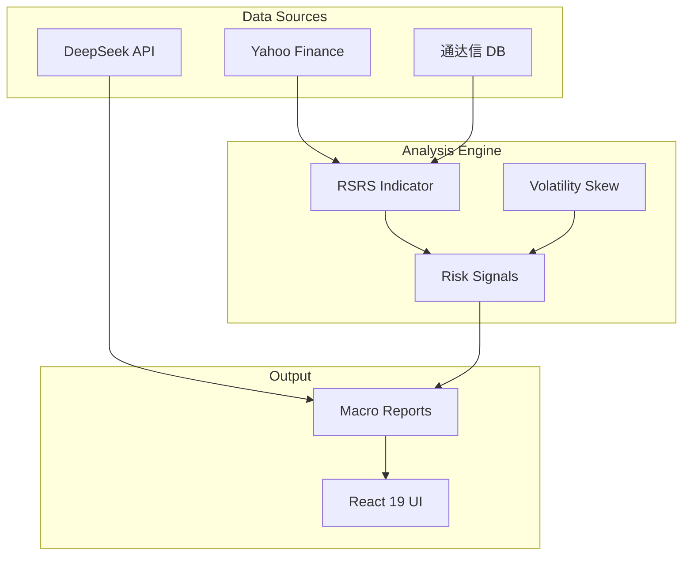

# Knowledge Graph - MY-DOGE-MICRO

> **Version**: v1.0.0  
> **Last Updated**: 2026-02-01

## Project Overview

MY-DOGE-MICRO is a triple-API driven quantitative trading analysis system integrating:
- **DeepSeek AI**: Macro analysis and strategy generation
- **Yahoo Finance**: Global asset price data
- **Tongda Xin DB**: Local A-share/US stock historical data

## System Topology

## T0 Document Index

| Document | Path | Purpose |
|----------|------|---------|
| Active Context | `core/active_context.md` | Current task state |
| Knowledge Graph | `core/knowledge_graph.md` | Navigation |
| Basic Law Index | `core/basic_law_index.md` | Core axioms |
| Procedural Law Index | `core/procedural_law_index.md` | Workflow pointers |
| Technical Law Index | `core/technical_law_index.md` | Standard pointers |

## T1 Document Index

| Document | Path | Purpose |
|----------|------|---------|
| System Patterns | `axioms/system_patterns.md` | Architecture constraints |
| Tech Context | `axioms/tech_context.md` | Interface definitions |
| Behavior Context | `axioms/behavior_context.md` | Runtime assertions |

## T2 Standards Index

| Document | Path | Status |
|----------|------|--------|
| DS-057 Frontend Architecture | `standards/DS-057_frontend_architecture_modernization.md` | 📋 Backlog |
| DS-051 Frontend Plan | `standards/DS-051_frontend_modernization_plan.md` | Pending |
| DS-052 Frontend Tasks | `standards/DS-052_frontend_modernization_tasks.md` | Pending |
| DS-055 UI Standard | `standards/DS-055_frontend_ui_standard.md` | In Progress |

## Active Feature: T-C5 Frontend Modernization

**Status**: 📋 Backlog (Pending Approval)

| Phase | Tasks | Effort | Deliverables |
|-------|-------|--------|--------------|
| Phase 1 | 4 | ~9h | Atomic structure + Tokens |
| Phase 2 | 10 | ~40h | 20+ atomic/molecule components |
| Phase 3 | 8 | ~60h | Full component migration |

**Key Docs**:
- [Feature Spec](standards/DS-057_frontend_architecture_modernization.md)
- [Implementation Plan](standards/DS-051_frontend_modernization_plan.md)
- [Atomic Tasks](standards/DS-052_frontend_modernization_tasks.md)

## Navigation

- Start with `core/active_context.md`
- Load T0 documents for any task
- Load T1 documents when detailed constraints needed
