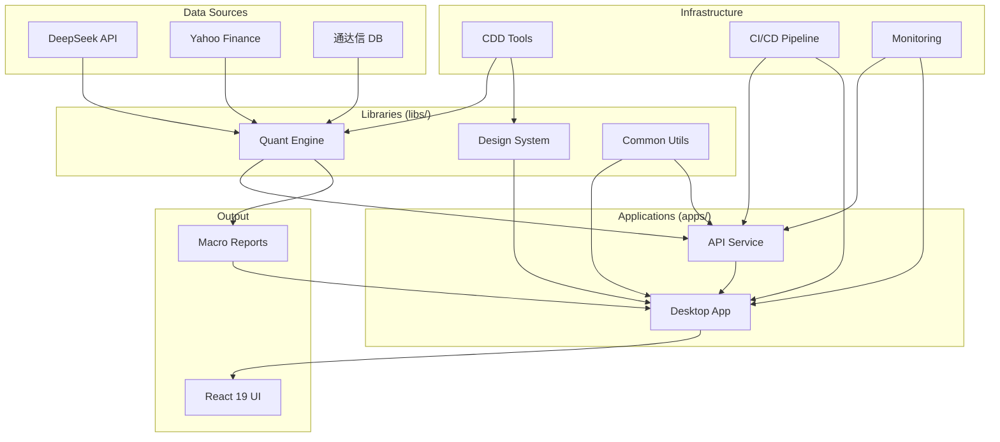

# Knowledge Graph - MY-DOGE-MICRO

> **Version**: v1.1.0  
> **Last Updated**: 2026-02-04  
> **Architecture**: Modular v1.6.0

## Project Overview

MY-DOGE-MACRO is a triple-API driven quantitative trading analysis system integrating:
- **DeepSeek AI**: Macro analysis and strategy generation
- **Yahoo Finance**: Global asset price data
- **Tongda Xin DB**: Local A-share/US stock historical data

## Modular Architecture (v1.6.0+)

```
Applications Layer (apps/)
├── desktop/          # Tauri + React 19 desktop application
└── api/             # FastAPI backend service

Libraries Layer (libs/)
├── quant-engine/    # Quantitative analysis algorithms
├── design-system/   # UI components and design tokens
└── common/          # Shared utilities

Infrastructure Layer (infrastructure/)
├── cdd/             # Constitution-Driven Development tools
├── ci-cd/           # Continuous integration/deployment
└── monitoring/      # System monitoring and alerts

Data & Configuration
├── data/            # Raw, processed data and reports
└── config/          # Environment and feature configurations

Documentation (docs/)
├── architecture/    # Architecture design documents
├── api/             # API documentation
└── deployment/      # Deployment guides
```

## System Topology



## Architecture Migration Status

| Component | Source | Target | Status | Details |
|-----------|--------|--------|--------|---------|
| **Design System** | `client/src/design-system/` | `libs/design-system/` | ✅ Complete | Symbolic link established |
| **Path Mapping** | Legacy imports | `@design-system/*`, `@libs/*` | ✅ Complete | tsconfig.json updated |
| **Frontend App** | `client/` | `apps/desktop/` | ⏳ Planned | Next phase |
| **Backend API** | `server/` | `apps/api/` | ⏳ Planned | Next phase |
| **Quant Engine** | `engine/` | `libs/quant-engine/` | ⏳ Planned | Next phase |
| **CDD Tools** | `scripts/` | `infrastructure/cdd/tools/` | ⏳ Planned | Next phase |

## T0 Document Index

| Document | Path | Purpose |
|----------|------|---------|
| Active Context | `core/active_context.md` | Current task state |
| Knowledge Graph | `core/knowledge_graph.md` | Navigation |
| Basic Law Index | `core/basic_law_index.md` | Core axioms |
| Procedural Law Index | `core/procedural_law_index.md` | Workflow pointers |
| Technical Law Index | `core/technical_law_index.md` | Standard pointers |

## T1 Document Index

| Document | Path | Purpose |
|----------|------|---------|
| System Patterns | `axioms/system_patterns.md` | Architecture constraints |
| Tech Context | `axioms/tech_context.md` | Interface definitions |
| Behavior Context | `axioms/behavior_context.md` | Runtime assertions |

## T2 Standards Index

| Document | Path | Status |
|----------|------|--------|
| DS-057 Frontend Architecture | `standards/DS-057_frontend_architecture_modernization.md` | 📋 Backlog |
| DS-051 Frontend Plan | `standards/DS-051_frontend_modernization_plan.md` | Pending |
| DS-052 Frontend Tasks | `standards/DS-052_frontend_modernization_tasks.md` | Pending |
| DS-055 UI Standard | `standards/DS-055_frontend_ui_standard.md` | In Progress |

## ✅ COMPLETED: Frontend Architecture Modernization (T-C5)

**Status**: ✅ Complete (2026-02-03)

### Summary
- **Total Tasks**: 29/29 complete
- **Components**: 7 Atoms + 4 Molecules implemented
- **CSS Strategy**: BEM Naming + CSS Variables (Plan A)
- **System Entropy**: $H_{sys} = 0.50$ 🟡

### Completed Phases

| Phase | Tasks | Status | Deliverables |
|-------|-------|--------|--------------|
| Phase 1 | 7 tasks | ✅ Complete | Atomic structure + Tokens + CSS Standards |
| Phase 2 | 10 tasks | ✅ Complete | 11 atomic/molecule components |
| Phase 3 | 8 tasks | ✅ Complete | Full component migration |
| Phase 4 | 4 tasks | ✅ Complete | Finalization and documentation |

### Key Deliverables
- **CSS Standards**: BEM naming with CSS variables
- **Component Library**: 7 Atoms + 4 Molecules
- **Documentation**: `client/DESIGN_SYSTEM.md`
- **Bug Fixes**: BEM naming corrections applied
- **CI/CD**: All tests passing (GitHub runs: 21643742961, 21644194375, 21644432233)

### Key Decisions
- **CSS Strategy**: BEM Naming + CSS Variables (Plan A)
- **Naming Format**: `Block--Element--Modifier` (double hyphen)
- **Reference**: `standards/DS-051_frontend_modernization_plan.md`

**Key Docs**:
- [Feature Spec](standards/DS-057_frontend_architecture_modernization.md)
- [Implementation Plan](standards/DS-051_frontend_modernization_plan.md)
- [Atomic Tasks](standards/DS-052_frontend_modernization_tasks.md)
- [Finalization](tasks/T0-T-C5-Finalize.md)

## Navigation

- Start with `core/active_context.md`
- Load T0 documents for any task
- Load T1 documents when detailed constraints needed
