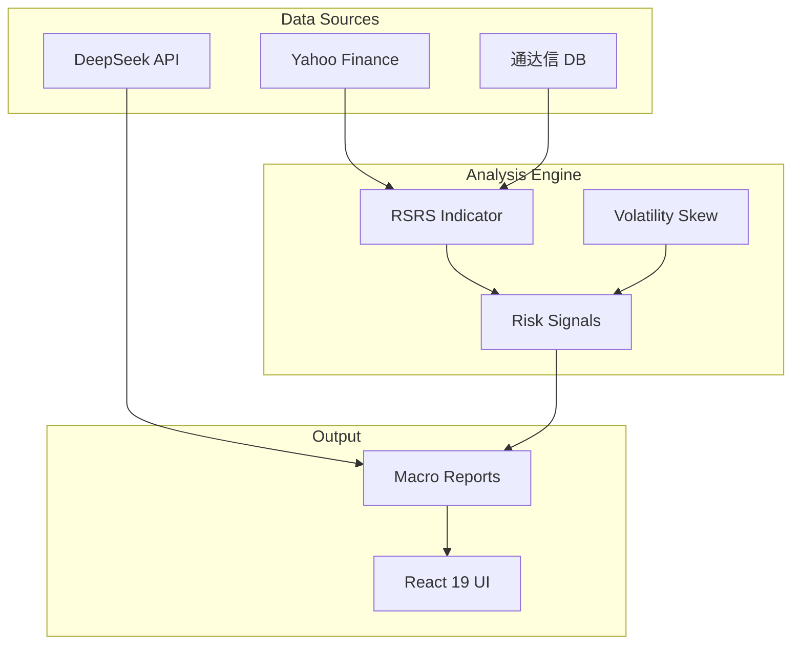

# Knowledge Graph - MY-DOGE-MICRO

> **Version**: v1.0.0  
> **Last Updated**: 2026-02-01

## Project Overview

MY-DOGE-MICRO is a triple-API driven quantitative trading analysis system integrating:
- **DeepSeek AI**: Macro analysis and strategy generation
- **Yahoo Finance**: Global asset price data
- **Tongda Xin DB**: Local A-share/US stock historical data

## System Topology

## T0 Document Index

| Document | Path | Purpose |
|----------|------|---------|
| Active Context | `core/active_context.md` | Current task state |
| Knowledge Graph | `core/knowledge_graph.md` | Navigation |
| Basic Law Index | `core/basic_law_index.md` | Core axioms |
| Procedural Law Index | `core/procedural_law_index.md` | Workflow pointers |
| Technical Law Index | `core/technical_law_index.md` | Standard pointers |

## T1 Document Index

| Document | Path | Purpose |
|----------|------|---------|
| System Patterns | `axioms/system_patterns.md` | Architecture constraints |
| Tech Context | `axioms/tech_context.md` | Interface definitions |
| Behavior Context | `axioms/behavior_context.md` | Runtime assertions |

## Navigation

- Start with `core/active_context.md`
- Load T0 documents for any task
- Load T1 documents when detailed constraints needed
