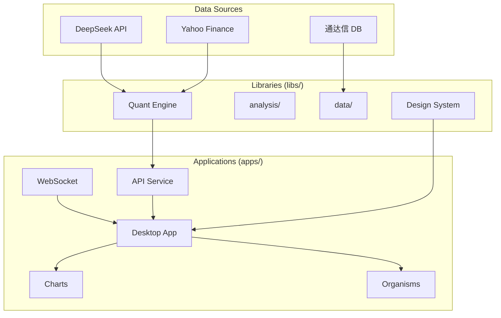

# Knowledge Graph - MY-DOGE-MACRO

> **Version**: v1.8.0  
> **Last Updated**: 2026-02-05  
> **Architecture**: Modular v1.8.0 (Core Features Complete)

## Project Overview

MY-DOGE-MACRO is a triple-API driven quantitative trading analysis system integrating:
- **DeepSeek AI**: Macro analysis and strategy generation
- **Yahoo Finance**: Global asset price data
- **Tongda Xin DB**: Local A-share/US stock historical data

## Modular Architecture (v1.8.0)

```
Applications Layer (apps/)
├── desktop/          # Tauri + React 19 desktop application ✅
│   └── src/components/
│       ├── atoms/        # Button, Badge, Card, Icon, Input...
│       ├── molecules/    # DataCard, SearchBar, FormGroup...
│       ├── organisms/    # MarketOverview, AnalysisPanel, AIReportPanel
│       └── charts/       # PriceChart, SubChart, ChartPanel
└── api/              # FastAPI backend service ✅
    └── core/websocket.py  # Real-time price push

Libraries Layer (libs/)
├── quant-engine/     # Quantitative analysis algorithms ✅
│   ├── analysis/     # technical_indicators.py (MA/MACD/RSI/KDJ/Bollinger)
│   └── data/         # tdx_reader.py (通达信 integration)
├── design-system/    # UI components and design tokens ✅
└── common/           # Shared utilities

Infrastructure Layer (infrastructure/)
├── cdd/              # Constitution-Driven Development tools ✅
│   └── tools/        # cdd_audit.py, measure_entropy.py, verify_version.py
├── ci-cd/            # Continuous integration/deployment
└── monitoring/       # System monitoring and alerts

Data & Configuration
├── data/             # Raw, processed data and reports
└── config/           # Environment and feature configurations

Documentation (memory_bank/t3_documentation/)  # 扁平结构
├── api-reference.md   # Full REST/WebSocket API
├── backend-api.md     # 后端接口详情
├── deployment.md      # 部署指南
├── getting-started.md # 开发入门
├── index.md          # 文档索引
├── indicators.md      # Technical indicators formulas
├── modular-architecture.md # 模块化架构
├── overview.md       # 架构概览
├── quickstart.md     # 快速入门
└── document-template.md # 文档模板
```

## System Topology



## Architecture Migration Status

| Component | Source | Target | Status | Details |
|-----------|--------|--------|--------|---------|
| **Design System** | `client/` | `libs/design-system/` | ✅ Complete | Atomic Design + BEM |
| **Frontend App** | `client/` | `apps/desktop/` | ✅ Complete | React 19 + Tauri v2 |
| **Backend API** | `server/` | `apps/api/` | ✅ Complete | FastAPI + WebSocket |
| **Quant Engine** | `engine/` | `libs/quant-engine/` | ✅ Complete | Technical indicators + TDX |
| **CDD Tools** | `scripts/` | `infrastructure/cdd/tools/` | ✅ Complete | Audit + Entropy |

## T0 Document Index

| Document | Path | Purpose |
|----------|------|---------|
| Active Context | `core/active_context.md` | Current task state |
| Knowledge Graph | `core/knowledge_graph.md` | Navigation (this file) |
| Basic Law Index | `core/basic_law_index.md` | Core axioms |
| Procedural Law Index | `core/procedural_law_index.md` | Workflow pointers |
| Technical Law Index | `core/technical_law_index.md` | Standard pointers |

## T1 Document Index

| Document | Path | Purpose |
|----------|------|---------|
| System Patterns | `t1_axioms/system_patterns.md` | Architecture constraints |
| Tech Context | `t1_axioms/tech_context.md` | Interface definitions |
| Behavior Context | `t1_axioms/behavior_context.md` | Runtime assertions |

## T2 Standards Index

| Document | Path | Status |
|----------|------|--------|
| DS-058 v1.8.0 Roadmap | `t2_standards/DS-058_v180_roadmap.md` | ✅ Complete |
| DS-057 Frontend Architecture | `t2_standards/DS-057_frontend_architecture_modernization.md` | ✅ Complete |
| DS-055 UI Standard | `t2_standards/DS-055_frontend_ui_standard.md` | ✅ Complete |

## ✅ v1.8.0 Core Features (Complete)

**Status**: ✅ Complete (2026-02-05)

### Summary
- **Charts Module**: K-line + MACD/RSI/KDJ/Volume subcharts
- **Organisms**: MarketOverview, AnalysisPanel, AIReportPanel
- **Backend**: WebSocket real-time push
- **Quant Engine**: Full technical indicators library
- **Data**: 通达信 database integration

### Files Created

| Category | Files | Count |
|----------|-------|-------|
| Charts | TechnicalIndicators, SubChart, ChartPanel | 7 |
| Organisms | MarketOverview, AnalysisPanel, AIReportPanel | 6 |
| Backend | websocket.py, technical_indicators.py, tdx_reader.py | 3 |
| Docs | api-reference.md, indicators.md | 2 |

### System Entropy
- $H_{sys} = 0.30$ 🟢 (Healthy)

## ✅ v1.7.0 Architecture Migration (Complete)

**Status**: ✅ Complete (2026-02-05)

- `client/` → `apps/desktop/` ✅
- `server/` → `apps/api/` ✅
- `engine/` → `libs/quant-engine/` ✅
- `scripts/` → `infrastructure/cdd/tools/` ✅

## ✅ v1.5.0 Frontend Modernization (Complete)

**Status**: ✅ Complete (2026-02-03)

- **Total Tasks**: 29/29 complete
- **Components**: 7 Atoms + 4 Molecules
- **CSS Strategy**: BEM Naming + CSS Variables

## Navigation

- Start with `core/active_context.md`
- Load T0 documents for any task
- Load T1 documents when detailed constraints needed
- Check `memory_bank/t3_documentation/` for API reference (扁平结构)
