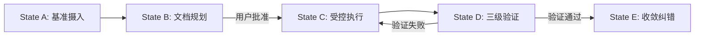

# 程序法索引 (Procedural Law Index)

**版本**: v1.8.1 (MY-DOGE-MACRO融合工作流索引)
**状态**: 🟢 活跃
**说明**: MY-DOGE-MACRO程序法工作流索引，整合了所有开发、运维与危机处理流程。精确反映本项目v1.8.1状态和工作流实际位置。

---

## 第一章：核心工作流 (§200-§209)

| 条款 | 工作流名称 | 文件路径 (Pointer) | 核心用途 | 项目状态 |
|------|------------|-------------------|----------|----------|
| **§201** | **CDD流程** | `memory_bank/t2_protocols/WF-201_cdd_workflow.md` | **新功能开发/重构 (默认流程)** | ✅ 活跃 |
| **§202** | 灰度晋升 | `memory_bank/t2_protocols/WF-202_灰度晋升协议工作流程实现.md` | 代码从 Staging 到 Prod 的晋升 | ⚠️ 文件不存在 |
| **§203** | 知识管理 | `memory_bank/t2_protocols/WF-203_知识管理流程工作流程实现.md` | 知识库的增删改查 | ⚠️ 文件不存在 |
| **§204** | 危机处理 | `memory_bank/t2_protocols/WF-204_危机处理流程工作流程实现.md` | 系统崩溃或数据损坏时的应急响应 | ✅ 实际存在 |
| **§205** | 版本发布 | `memory_bank/t2_protocols/WF-205_版本发布流程工作流程实现.md` | 发版与 Changelog 生成 | ⚠️ 文件不存在 |
| **§206** | 三位一体收敛 | `memory_bank/t2_protocols/WF-206_三位一体收敛协议工作流程实现.md` | 解决架构、代码、文档不一致 | ⚠️ 文件不存在 |
| **§207** | 文件审查隔离 | `memory_bank/t2_protocols/WF-207_文件审查与隔离协议工作流程实现.md` | 敏感文件或不受信代码处理 | ⚠️ 文件不存在 |
| **§209** | 房间绑定 | `memory_bank/t2_protocols/WF-209_房间绑定信息读取流程工作流程实现.md` | 多房间环境配置 | ⚠️ 文件不存在 |

**说明**: 本项目实际工作流文件位于 `memory_bank/t2_protocols/` 目录。

---

## 第二章：专项操作流程 (§210-§229)

| 条款 | 工作流名称 | 文件路径 (Pointer) | 核心用途 | 项目状态 |
|------|------------|-------------------|----------|----------|
| **§210** | 安全操作 | `memory_bank/t2_protocols/WF-210_安全操作流程工作流程实现.md` | 涉及鉴权、加密的操作 | ⚠️ 文件不存在 |
| **§220** | MCP运维 | `memory_bank/t2_protocols/WF-220_MCP运维流程工作流程实现.md` | MCP 服务器的部署与维护 | ⚠️ 文件不存在 |

---

## 第三章：孵化与回流流程 (§230-§239)

| 条款 | 工作流名称 | 文件路径 (Pointer) | 核心用途 | 项目状态 |
|------|------------|-------------------|----------|----------|
| **§230** | **项目孵化流程** | `memory_bank/t2_protocols/` (待实现) | **从主项目创建专门化子项目进行实验性开发** | 📋 待实现 |
| **§231** | 架构回流流程 | `memory_bank/t2_protocols/` (待实现) | 将子项目验证成功的技术架构同步回主项目 | 📋 待实现 |
| **§232** | 版本协调流程 | `memory_bank/t2_protocols/` (待实现) | 管理主项目与子项目间的版本兼容性与同步策略 | 📋 待实现 |

**宪法依据**: §102.3宪法同步公理、§141熵减验证、§152单一真理源公理、§110协作效率公理

**核心原则**:
1. **实验隔离**: 在子项目中实验高风险或专门化架构，保护主项目稳定性
2. **成果验证**: 子项目验证成功后，通过回流流程将优化成果同步回主项目
3. **版本控制**: 严格管理版本兼容性，确保同步过程符合宪法约束

---

## 第四章：CDD 五状态工作流引擎 (MY-DOGE-MACRO v1.8.1)

### 4.1 状态详细定义

1. **State A (Ingest)**: 读取 `memory_bank/t0_core/`，建立项目上下文
2. **State B (Plan)**: **文档先行**。严禁直接修改代码，必须先修改文档并获批
3. **State C (Execute)**: 依据文档执行原子代码修改，严格遵循技术标准
4. **State D (Verify)**: 执行 Tier 1 (结构) -> Tier 2 (签名) -> Tier 3 (行为) 验证
5. **State E (Converge)**: 确保系统熵值降低，更新 `active_context.md`

### 4.2 项目实际状态转换

| From | To | Trigger | 项目状态 |
|------|-----|---------|----------|
| A | B | T0文档加载完成 | ✅ 活跃 |
| B | C | 用户批准 (YES) | ✅ 活跃 |
| C | D | 代码执行完成 | ✅ 活跃 |
| D | C | 验证失败 | ✅ 活跃 |
| D | E | 所有三级验证通过 | ✅ 活跃 |
| E | A | 新任务或继续 | ✅ 活跃 |

---

## 第五章：项目实际工作流 (MY-DOGE-MACRO v1.8.1)

### 5.1 现有工作流文件

| Workflow | 文件 | 用途 | 状态 |
|----------|------|------|------|
| **Clarify** | `memory_bank/t2_protocols/WF-001_clarify_workflow.md` | 问题澄清工作流 | ✅ 存在 |
| **Main CDD** | `memory_bank/t2_protocols/WF-201_cdd_workflow.md` | 核心CDD工作流 | ✅ 存在 |
| **Crisis** | `memory_bank/t2_protocols/WF-204_危机处理流程工作流程实现.md` | 危机处理工作流 | ✅ 实际存在 |
| **Amend** | `memory_bank/t2_protocols/WF-amend.md` | 修正工作流 | ✅ 存在 |
| **Analyze** | `memory_bank/t2_protocols/WF-analyze.md` | 分析工作流 | ✅ 存在 |
| **Review** | `memory_bank/t2_protocols/WF-review.md` | 审查工作流 | ✅ 存在 |
| **Sync Issues** | `memory_bank/t2_protocols/WF-sync-issues.md` | 同步问题工作流 | ✅ 存在 |

### 5.2 项目特定工作流执行历史

| 工作流 | 目的 | 最后执行 | 状态 |
|--------|------|----------|------|
| **v1.5.0 前端现代化** | Atomic Design + BEM | ✅ 2026-02-03 | 已完成 |
| **v1.7.0 架构迁移** | 模块化结构迁移 | ✅ 2026-02-05 | 已完成 |
| **v1.8.0 核心功能** | 图表 + 仪表板 + WebSocket | ✅ 2026-02-05 | 已完成 |
| **.clinerules合并** | 宪法文件融合与精简 | ⏳ 当前执行中 | 进行中 |
| **WF-204危机处理** | 危机处理流程实现 | ✅ 2026-02-09 | 已完成 |

---

## 第六章：检索协议 (MY-DOGE-MACRO优化版)

### 6.1 按编号检索
- 输入 "§201" -> 定位 `memory_bank/t2_protocols/WF-201_cdd_workflow.md`
- 输入 "§204" -> 定位 `memory_bank/t2_protocols/WF-204_危机处理流程工作流程实现.md`

### 6.2 按场景检索 (项目优化版)
- **"我要写新功能"** -> §201 (CDD流程)
- **"系统挂了"** -> §204 (危机处理流程)
- **"发布版本"** -> 执行自动化版本发布脚本
- **"清理技术债务"** -> 执行三位一体收敛协议 (架构-代码-文档对齐)

### 6.3 按目录检索
- 所有工作流文件: `memory_bank/t2_protocols/`
- CDD核心文件: `memory_bank/t2_protocols/WF-201_cdd_workflow.md`
- 危机处理: `memory_bank/t2_protocols/WF-204_危机处理流程工作流程实现.md`
- 问题澄清: `memory_bank/t2_protocols/WF-001_clarify_workflow.md`

---

## 第七章：工作流实现优先级

### 7.1 高优先级 (待实现)
1. **WF-210 安全操作流程** - 安全合规要求
2. **WF-220 MCP运维流程** - MCP服务管理

### 7.2 中优先级 (待实现)
1. **WF-202 灰度晋升流程** - 发布管理
2. **WF-205 版本发布流程** - 版本控制
3. **WF-206 三位一体收敛** - 架构治理

### 7.3 低优先级 (待实现)
1. **WF-203 知识管理流程** - 知识库维护
2. **WF-207 文件审查隔离** - 安全审查
3. **WF-209 房间绑定** - 多环境配置

### 7.4 已完成
1. **WF-204 危机处理流程** - 系统稳定性基础 ✅

---

## 第八章：版本信息

| 组件 | 版本 | 状态 |
|------|------|------|
| **程序法索引** | v1.8.1 | ✅ 融合完成 |
| **CDD框架** | v1.6.1 | ✅ 运行中 |
| **项目版本** | MY-DOGE-MACRO v1.8.1 | ✅ 活跃 |
| **工作流目录** | `memory_bank/t2_protocols/` | ✅ 实际位置 |
| **缺失工作流** | 8个待实现 | 📋 待开发 |

---

## 第九章：宪法合规性

### 9.1 §102.3宪法同步公理
- 工作流版本与项目版本同步为v1.8.1
- 路径引用与实际文件位置保持一致
- 已更新WF-204状态为实际存在

### 9.2 §152单一真理源公理
- 所有工作流引用指向`memory_bank/t2_protocols/`
- 消除重复和冲突的工作流定义
- WF-204文件已实际存在并准确引用

### 9.3 §141熵减验证
- 明确标识缺失的工作流文件
- 提供实现优先级指导
- 减少不确定性，提高系统有序度
- WF-204关键工作流已实现

### 9.4 §125数据完整性公理
- 准确反映项目实际工作流状态
- 提供明确的待实现任务列表
- 危机处理关键工作流已实现

---

*遵循宪法约束: 流程即索引，执行即检索。本项目精确反映MY-DOGE-MACRO v1.8.1工作流状态。*

**程序法版本**: v1.8.1 | **更新时间**: 2026-02-09 | **项目**: MY-DOGE-MACRO