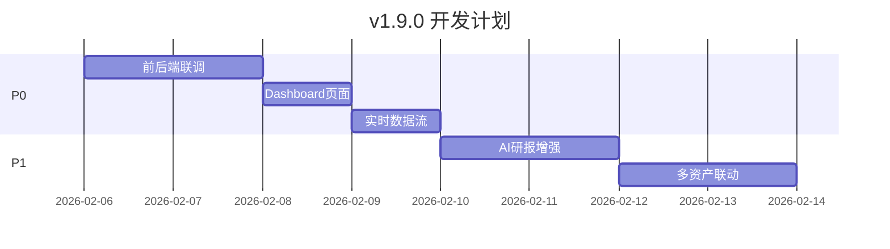

# MY-DOGE-MACRO v1.9.0+ 开发路线图

**创建日期**: 2026-02-06  
**当前版本**: v1.8.0 (核心功能完成)  
**规划者**: Clawd 🦞

---

## 📊 v1.8.0 完成状态回顾

### ✅ 已完成功能

| 模块 | 功能 | 状态 |
|------|------|------|
| **前端 Charts** | K线图 + 技术指标 (MA/EMA/MACD/RSI/KDJ/Bollinger) | ✅ |
| **前端 Organisms** | MarketOverview, AnalysisPanel, AIReportPanel | ✅ |
| **后端 WebSocket** | 实时价格推送 (`apps/api/core/websocket.py`) | ✅ |
| **量化引擎** | 完整技术指标库 (`libs/quant-engine/analysis/`) | ✅ |
| **数据源** | 通达信数据库集成 (`libs/quant-engine/data/tdx_reader.py`) | ✅ |
| **文档体系** | 统一 memory_bank/ 四层架构 (T0-T3) | ✅ |
| **代码清理** | 遗留目录删除，标准入口 `main.py` | ✅ |

### 🏗️ 当前架构

```
MY-DOGE-MACRO/
├── apps/
│   ├── desktop/          # React 19 + Tauri v2 ✅
│   │   └── src/components/
│   │       ├── atoms/    # 7 个原子组件
│   │       ├── molecules/# 4 个分子组件
│   │       ├── organisms/# 3 个有机体
│   │       └── charts/   # 4 个图表组件
│   └── api/              # FastAPI + WebSocket ✅
│       └── main.py       # 标准入口
├── libs/
│   ├── quant-engine/     # 量化引擎 ✅
│   └── design-system/    # 设计系统 ✅
├── infrastructure/
│   └── cdd/              # CDD 工具 ✅
└── memory_bank/          # 统一文档体系 ✅
    ├── t0_core/
    ├── t1_axioms/
    ├── t2_standards/
    ├── t2_protocols/
    └── t3_documentation/
```

---

## 🎯 v1.9.0 开发计划 (用户体验完善)

### 阶段目标
完成端到端用户流程，实现真正可用的量化分析工具

### P0 任务 (必须完成)

#### T-1.9.0-01: 前后端完整联调
**预计工时**: 4-6 小时

| 子任务 | 描述 | 状态 |
|--------|------|------|
| T-01a | API 服务层 (services/) 完善 | 📋 |
| T-01b | 前端 API 调用封装 (fetch/axios) | 📋 |
| T-01c | Zustand Store 与 API 集成 | 📋 |
| T-01d | WebSocket 客户端实现 | 📋 |
| T-01e | 错误处理 + 加载状态 | 📋 |

#### T-1.9.0-02: Dashboard 完整页面
**预计工时**: 3-4 小时

| 子任务 | 描述 | 状态 |
|--------|------|------|
| T-02a | Dashboard Template 组装 | 📋 |
| T-02b | 路由配置 (React Router) | 📋 |
| T-02c | 响应式布局优化 | 📋 |
| T-02d | 主题切换 (深色/浅色) | 📋 |

#### T-1.9.0-03: 实时数据流
**预计工时**: 3-4 小时

| 子任务 | 描述 | 状态 |
|--------|------|------|
| T-03a | WebSocket 连接管理 (前端) | 📋 |
| T-03b | 价格实时更新 UI | 📋 |
| T-03c | 断线重连机制 | 📋 |

### P1 任务 (重要)

#### T-1.9.0-04: AI 研报增强
**预计工时**: 4-5 小时

| 子任务 | 描述 | 状态 |
|--------|------|------|
| T-04a | 研报生成触发流程 | 📋 |
| T-04b | 研报历史存储 | 📋 |
| T-04c | 研报展示优化 (Markdown 渲染) | 📋 |
| T-04d | 研报导出 (Markdown/PDF) | 📋 |

#### T-1.9.0-05: 多资产联动分析
**预计工时**: 4-5 小时

| 子任务 | 描述 | 状态 |
|--------|------|------|
| T-05a | 相关性矩阵计算 | 📋 |
| T-05b | 联动分析可视化 | 📋 |
| T-05c | 科技股/黄金/BTC 监控 | 📋 |

#### T-1.9.0-06: 警报系统
**预计工时**: 3-4 小时

| 子任务 | 描述 | 状态 |
|--------|------|------|
| T-06a | 价格阈值警报 | 📋 |
| T-06b | 技术指标信号警报 | 📋 |
| T-06c | 系统通知 (Tauri Notification) | 📋 |

---

## 🚀 v2.0.0 开发计划 (生产就绪)

### 阶段目标
实现生产级部署和多用户支持

### P0 任务

| ID | 功能 | 描述 | 工时 |
|----|------|------|------|
| T-2.0.0-01 | Docker 容器化 | API + 前端完整容器化 | 4h |
| T-2.0.0-02 | 用户认证 | JWT + 可选 OAuth2 | 6h |
| T-2.0.0-03 | 数据持久化 | SQLite/PostgreSQL 支持 | 4h |

### P1 任务

| ID | 功能 | 描述 | 工时 |
|----|------|------|------|
| T-2.0.0-04 | 性能优化 | 缓存 + 懒加载 + 虚拟滚动 | 4h |
| T-2.0.0-05 | 多 AI 模型 | GPT-4 / Claude / Gemini 选择 | 4h |
| T-2.0.0-06 | 投资组合 | 组合管理 + 风险分析 | 6h |

### P2 任务

| ID | 功能 | 描述 | 工时 |
|----|------|------|------|
| T-2.0.0-07 | 回测框架 | 策略回测 + 绩效报告 | 8h |
| T-2.0.0-08 | 多语言 | i18n 国际化 (zh/en) | 4h |
| T-2.0.0-09 | 移动端适配 | 响应式 + PWA | 6h |

---

## 📅 建议执行顺序

### 短期目标 (本周)



**推荐启动顺序**:
1. **T-1.9.0-01** 前后端联调 ← 最高优先级
2. **T-1.9.0-02** Dashboard 页面
3. **T-1.9.0-03** 实时数据流
4. **T-1.9.0-04** AI 研报增强

### 中期目标 (下周)

- T-1.9.0-05: 多资产联动分析
- T-1.9.0-06: 警报系统
- 准备 v2.0.0 Docker 化

### 长期目标 (本月)

- v2.0.0 生产就绪版本
- 用户认证 + 数据持久化
- 可选：回测框架

---

## 🔧 技术决策

| 决策点 | 选择 | 理由 |
|--------|------|------|
| API 客户端 | fetch + 自定义 Hook | 轻量，Zustand 集成 |
| WebSocket | 原生 WebSocket | 已有后端实现 |
| 路由 | React Router v6 | 标准选择 |
| Markdown 渲染 | react-markdown | 研报展示 |
| 通知 | Tauri Notification API | 原生体验 |
| 数据库 | SQLite (开发) → PostgreSQL (生产) | 渐进式 |

---

## 📊 熵值预估

| 阶段 | 预估熵值 | 风险 |
|------|----------|------|
| v1.9.0 完成 | $H_{sys} \approx 0.35$ | 🟢 低 |
| v2.0.0 完成 | $H_{sys} \approx 0.45$ | 🟢 低 |
| v2.0.0+ | $H_{sys} \approx 0.50$ | 🟡 中 |

---

## 📋 下一步行动

确认后立即开始 **T-1.9.0-01: 前后端完整联调**:

1. 检查 `apps/api/` 现有路由
2. 创建前端 API 服务层
3. 集成 Zustand Store
4. 实现 WebSocket 客户端

---

*基于 CDD v1.6.1 工作流规划 | 更新: 2026-02-06*
